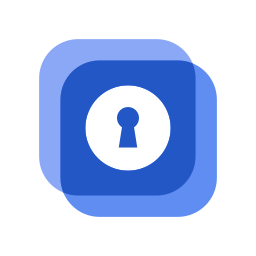
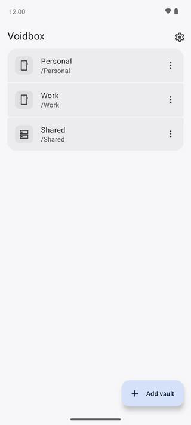
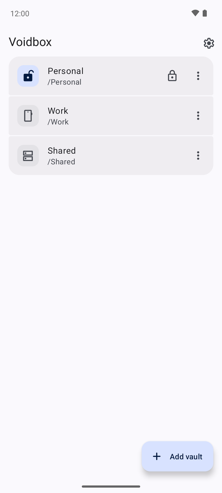
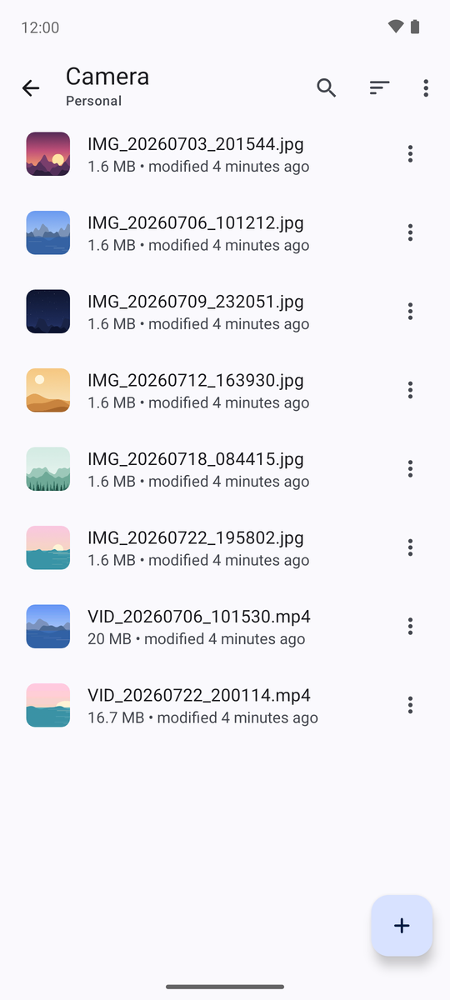
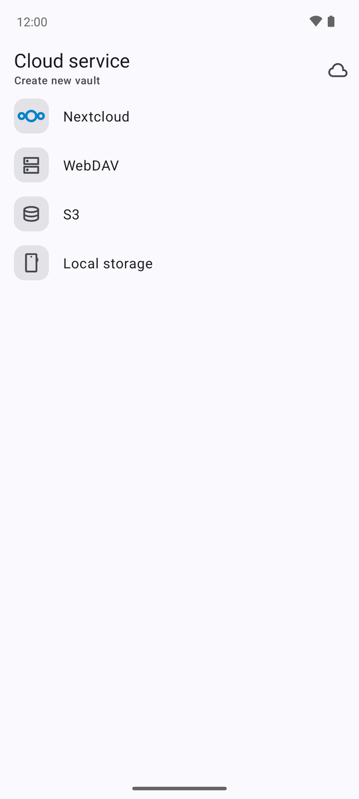
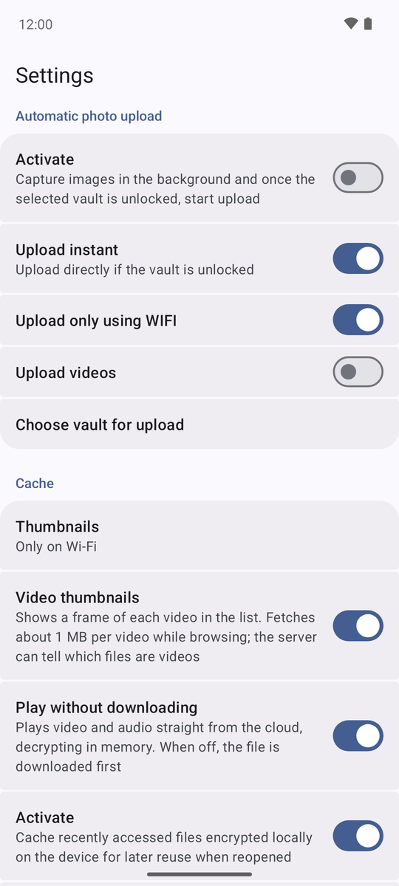

<p align="center">
  
</p>

<h1 align="center">Voidbox</h1>

<p align="center">
  <b>Your files, encrypted on your phone, kept in your own cloud.</b>
</p>

<p align="center">
  <a href="https://github.com/voidbox-app/android/releases/latest"></a>
  <a href="https://github.com/voidbox-app/android/actions/workflows/ci.yml"></a>
  <a href="https://github.com/voidbox-app/android/actions/workflows/ci.yml"></a>
  <a href="LICENSE.txt"></a>
</p>

<p align="center">
  <a href="https://github.com/voidbox-app/android/releases/latest"><b>Download for Android</b></a>
  &nbsp;·&nbsp;
  <a href="#features">Features</a>
  &nbsp;·&nbsp;
  <a href="PRIVACY.md">Privacy</a>
</p>

<p align="center">
  
</p>

Voidbox keeps your documents, photos and videos private in the cloud you already use. Every file
is encrypted on your phone before it leaves it, so your provider only ever stores data it cannot
read. Vaults use the open Cryptomator format: the same vault opens with Cryptomator on Windows,
macOS, Linux and iOS.

Free and open source. No ads, no tracking, no account.

## Screenshots

<p align="center">
  
  
  
  
</p>

## Features

**Private by design**
- File contents and names are encrypted on the device with AES-256.
- Nothing leaves the phone except encrypted files, and only to the cloud you chose.
- Thumbnails and offline copies are stored encrypted too.

**Your cloud, your choice**
- Nextcloud, with sign-in through your browser.
- Any WebDAV server and any S3-compatible storage.
- A folder on the phone, or any app that provides documents.

**Made for photos and videos**
- Photos, video, audio, PDF and text open right in the app.
- Videos start playing at once: they stream from the cloud and are decrypted in memory, without a
  full download and without a decrypted copy on the disk.
- Thumbnails for photos and, if you like, for videos.

**Ready when you are offline**
- Keep chosen files on the phone, still encrypted, and open them without a connection.

**And the essentials**
- Automatic photo upload, biometric unlock and automatic locking.

## Download

| Source | |
|---|---|
| [GitHub Releases](https://github.com/voidbox-app/android/releases/latest) | Signed APK with a SHA-256 checksum |
| [Obtainium](https://obtainium.imranr.dev) | Add `https://github.com/voidbox-app/android` for automatic updates |
| F-Droid | Coming soon |

Voidbox runs on Android 8.0 and newer.

## Voidbox and Cryptomator

Voidbox is built on [Cryptomator for Android](https://github.com/cryptomator/android) and keeps its
vault format, so your vaults stay compatible with every Cryptomator app. On top of it, Voidbox adds
its own design, streaming playback, offline copies and thumbnails, and makes every feature
available for free.

Cryptomator updates are reviewed and taken over by hand, so Voidbox follows Cryptomator with a
short delay. The Cryptomator version it is based on is recorded in [UPSTREAM_TAG](UPSTREAM_TAG).

Voidbox is an independent project, not affiliated with Skymatic GmbH. Cryptomator is their
trademark.

## For developers

Build the app with JDK 21 and the Android SDK; no API keys are needed:

```bash
./gradlew :presentation:assembleLiteDebug
```

Run the unit tests of all modules with coverage:

```bash
./gradlew :presentation:koverXmlReportLite
```

Releases are signed with a certificate whose SHA-256 fingerprint is
`4c1fe944d1ef0f3fc8de7436b08e452cd4500cee5bdacb936504a1a5bb682b1d`. Check a download with
`apksigner verify --print-certs voidbox-<version>.apk` and the published `.sha256` checksum.

## Contributing

Bug reports, ideas and pull requests are welcome. Start with [CONTRIBUTING.md](CONTRIBUTING.md),
and report security issues privately as described in [SECURITY.md](SECURITY.md).

## License

Voidbox is free software under the [GNU General Public License v3.0](LICENSE.txt).
